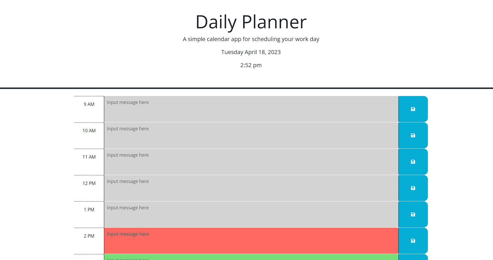

# Daily Planner Refactor

## Description
This daily calendar is designed to accept text and save it for future use. The timeslots are set up for use with the average work hours (9am - 5pm) and as the day progresses you the color of the timeslots will change based on if the time has already passed, it is currently that hour, or if the time is later in the day. 

Follow the link below to view the deployed application. 

[Daily Planner](https://mrbll48.github.io/daily-planner-refactor/)

## Screenshot

## Usage
The user will click into a time slot text area and type a message to save in that text area. When the save button is clicked on the right side of the row, the message will stay in the text area even after the page has been refreshed. The current date and time are displayed at the top of the page, and for easier use the current time is highlighted in red, times later in the day are highlighted in green, and times that have already passed are highlighted in gray. 

## Credits
Erik Hirsch: Program TA
Programming with Mosh: Youtube channel
freeCodeCamp.org: Youtube channel

## License
MIT